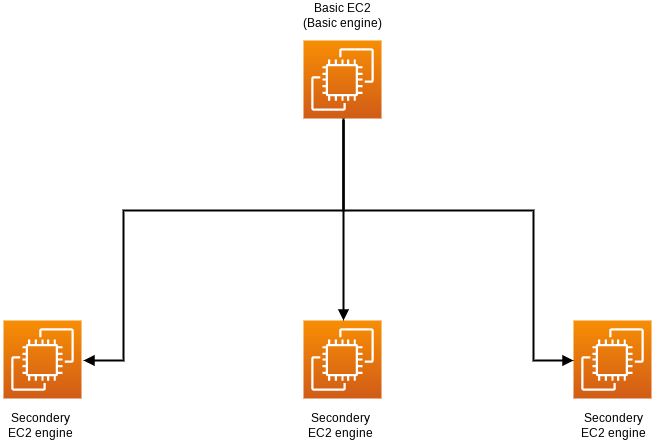

<style>
  p {
  font-size: 1.7em;
}
</style>

# Deployment (Microservices) Back-end

# Explain:

Deployment Back-end handles our two layers models between any servers  and interactions between them and communicates with Middleware Backend and itself. 
  
<p style = "text-align:center"></p>

- First thing we install a system on every server we want to use and make initial setup.
  - Initial setup establish file system and scripts needed and addressing all servers by basic configuration file. 
    ```toml
        [Servers]
        number = 1
            [Servers.0]
            ipv4 = "41.44.5.83"
    ``` 

  - Start all engines and make servers.
  - Loading all models written in basic Toml configuration file.
      ```toml
        [Basic]
        parent = 0
        model = '1-rfV85rTtGRMCi3ljUN0FgKnsiLjnPf5'

        [Second]
            [Second.0]
            parent = 0
            #Acne
            #9
            model = '1ECwXvWlPmi7m5frvhGq5z2vfPhldAU8j 
       ```

- When all engines running they making sure that all basic engine connected to basic engine.
  - All ips cahnges will go to basic engine and change it in configrations.
  - Every engine response to handling models in it server (run model edit it and remove it ) and redirct images to correct services **(that contain modls)**.


  - All changes will be saved in small database saves system state.
  - **Basic engine** has api to receive all changes from `Midlle-ware dashboard` and handle images and send images scores .
    
   
    ```json
        //response format
        {
            "category": "Acne and Rosacea",
            "predection": [
                {
                    "diseases": "milia",
                    "probability": 0.9999897480010986
                },
                {
                    "diseases": "Rosacea",
                    "probability": 5.848230102856178e-06
                },
                {
                    "diseases": "Infantile acne",
                    "probability": 1.3212483054303448e-06
                }
            ],
            "propability": 0.9999912977218628
        }
    
    ```

# tools:

- **Framework and libraries**:
  
  - We using **`FastApi`** for wrapping models ,**`FastApi`** is very fast and optimizable and we also using it for engines.
  - We using **`AWS EC2’s`** and sometimes **`Digitalocean droplets`** for servers.
  - We using libraries like **`jinja`** for templating models ,and networks libraries (**`Requests`**), and os libraries(**`os , subprocess`**) and toml for configuration.
  - Bash scripts for running files and make for setup configuration in servers.

  - **`Tensorflow`** and **`keras`** for models prediction process.
- **Languages** :  

  - **python** 
  
  - **bash** 
  

  
- **Tools and library**:
  
  - `Pycharm` :For coding and testing . 
  - `vsCode` :Also for coding and testing.
  
  - `Anaconda` :For python environments. 
  

- **Licences:**
  
  - MIT licences 
  
  -  BSD.
  


